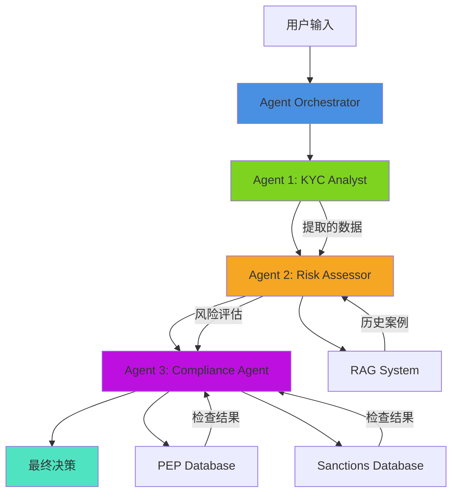
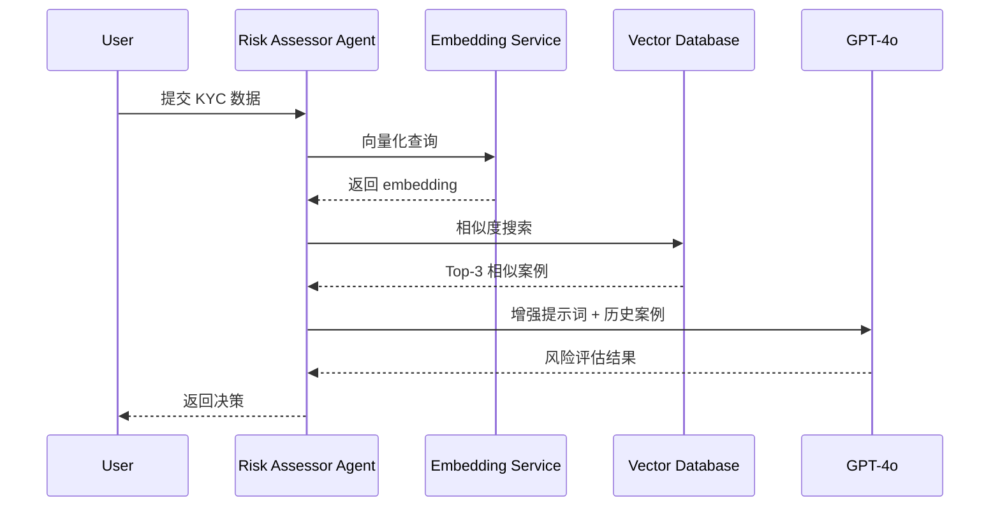
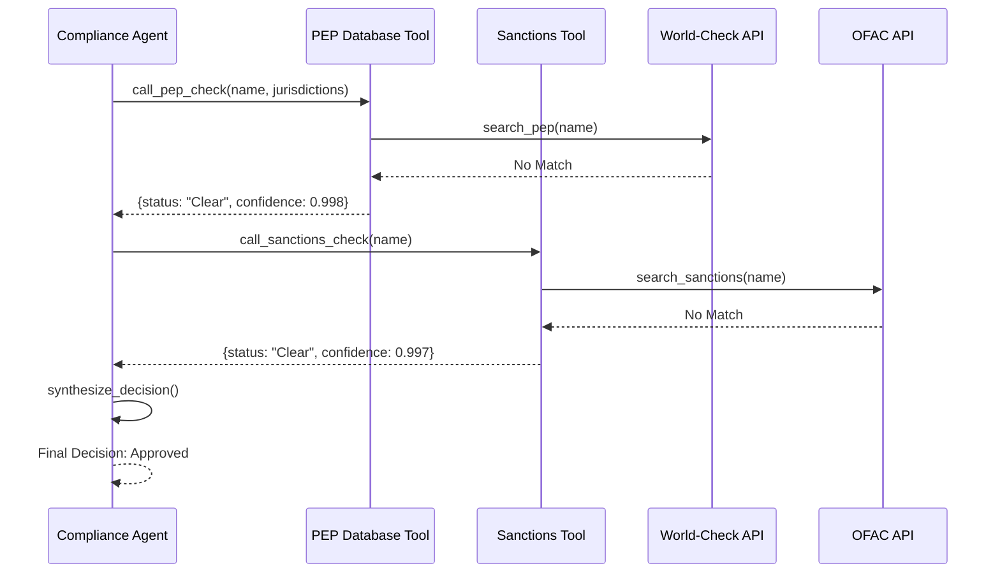

# xBanker AI Agent Suite - 系统架构文档

> **完整的技术架构说明，包含可视化图表**  
> **适合面试时展示和讲解**

---

## 📋 目录

1. [系统总览](#系统总览)
2. [Multi-Agent 架构](#multi-agent-架构)
3. [RAG 管道](#rag-管道)
4. [Tool Calling 机制](#tool-calling-机制)
5. [数据流](#数据流)
6. [技术栈](#技术栈)
7. [部署架构](#部署架构)

---

## 🎯 系统总览

### 高层架构

```
┌─────────────────────────────────────────────────────────────────┐
│                        xBanker AI Agent Suite                    │
│                                                                   │
│  ┌──────────────┐    ┌──────────────┐    ┌──────────────┐      │
│  │   Frontend   │    │   Backend    │    │   Database   │      │
│  │  (Next.js)   │◄──►│  (FastAPI)   │◄──►│ (PostgreSQL) │      │
│  └──────────────┘    └──────────────┘    └──────────────┘      │
│                             │                                     │
│                             ▼                                     │
│                   ┌──────────────────┐                          │
│                   │ Agent Orchestrator│                          │
│                   └──────────────────┘                          │
│                             │                                     │
│          ┌──────────────────┼──────────────────┐                │
│          ▼                   ▼                   ▼                │
│   ┌─────────────┐    ┌─────────────┐    ┌─────────────┐        │
│   │KYC Analyst  │    │Risk Assessor│    │ Compliance  │        │
│   │   Agent     │    │   Agent     │    │   Agent     │        │
│   │             │    │   (RAG)     │    │(Tool Calling)│       │
│   └─────────────┘    └─────────────┘    └─────────────┘        │
│                             │                   │                 │
│                             ▼                   ▼                 │
│                   ┌──────────────┐    ┌──────────────┐          │
│                   │Vector Database│    │External APIs │          │
│                   │  (Qdrant)    │    │ (PEP/Sanctions)│        │
│                   └──────────────┘    └──────────────┘          │
└─────────────────────────────────────────────────────────────────┘
```

### 核心组件

| 组件 | 技术 | 职责 |
|------|------|------|
| **Frontend** | Next.js 14 + TypeScript | 用户界面、实时可视化 |
| **Backend API** | FastAPI + Python | REST API、业务逻辑 |
| **Agent Orchestrator** | Python | 协调多个 Agent |
| **KYC Analyst Agent** | GPT-4o | 数据提取 |
| **Risk Assessor Agent** | GPT-4o + RAG | 风险评估 |
| **Compliance Agent** | GPT-4o + Tools | 合规检查 |
| **Database** | PostgreSQL | 持久化存储 |
| **Vector DB** | Qdrant (生产) | RAG 向量检索 |
| **Cache** | Redis | 性能优化 |

---

## 🤖 Multi-Agent 架构

### Agent 协同流程



### Agent 详细设计

#### 1. KYC Analyst Agent

```
┌─────────────────────────────────────────────┐
│         KYC Analyst Agent                   │
├─────────────────────────────────────────────┤
│ 输入:                                       │
│  - 客户名称                                 │
│  - KYC 文档（非结构化文本）                │
├─────────────────────────────────────────────┤
│ 处理:                                       │
│  1. 使用 GPT-4o 分析文本                   │
│  2. 提取结构化信息：                       │
│     - 财富来源                             │
│     - 业务活动                             │
│     - 司法管辖区                           │
│     - 潜在风险标记                         │
│  3. 返回 JSON 格式数据                     │
├─────────────────────────────────────────────┤
│ 输出:                                       │
│  {                                          │
│    "wealth_sources": [...],                 │
│    "business_activities": [...],            │
│    "jurisdictions": [...],                  │
│    "red_flags": [...],                      │
│    "confidence_score": 0.95                 │
│  }                                          │
└─────────────────────────────────────────────┘
```

#### 2. Risk Assessor Agent (RAG)

```
┌─────────────────────────────────────────────┐
│         Risk Assessor Agent                 │
├─────────────────────────────────────────────┤
│ 输入:                                       │
│  - KYC Analyst 提取的数据                  │
├─────────────────────────────────────────────┤
│ 处理:                                       │
│  1. RAG 检索阶段:                          │
│     a. 向量化当前案例                      │
│     b. 在向量数据库中搜索                  │
│     c. 检索 Top-3 相似案例                 │
│                                             │
│  2. 增强阶段:                              │
│     a. 构建上下文提示词                    │
│     b. 包含历史案例作为参考                │
│     c. GPT-4o 基于上下文评估               │
│                                             │
│  3. 风险评分:                              │
│     - 计算风险等级                         │
│     - 生成风险理由                         │
│     - 提供建议                             │
├─────────────────────────────────────────────┤
│ 输出:                                       │
│  {                                          │
│    "risk_score": "Medium",                  │
│    "risk_factors": [...],                   │
│    "similar_cases": [                       │
│      {                                      │
│        "case_id": "KYC-2024-0847",          │
│        "similarity": 0.89,                  │
│        "outcome": "Approved"                │
│      }                                      │
│    ],                                       │
│    "confidence": 0.92                       │
│  }                                          │
└─────────────────────────────────────────────┘
```

#### 3. Compliance Agent (Tool Calling)

```
┌─────────────────────────────────────────────┐
│         Compliance Agent                    │
├─────────────────────────────────────────────┤
│ 输入:                                       │
│  - Risk Assessor 的评估结果                │
├─────────────────────────────────────────────┤
│ 处理:                                       │
│  1. Tool Call 1: PEP Database              │
│     - 调用 PEP 检查工具                    │
│     - 搜索多个数据库                       │
│     - 返回匹配结果                         │
│                                             │
│  2. Tool Call 2: Sanctions Database        │
│     - 调用制裁名单工具                     │
│     - 检查 OFAC, UN, EU, UK                │
│     - 返回检查结果                         │
│                                             │
│  3. 综合决策:                              │
│     - 整合所有信息                         │
│     - GPT-4o 做最终决策                    │
│     - 生成决策理由                         │
│     - 提供后续建议                         │
├─────────────────────────────────────────────┤
│ 输出:                                       │
│  {                                          │
│    "compliance_status": "Approved",         │
│    "confidence_score": 0.98,                │
│    "risk_score": 15,                        │
│    "pep_flag": false,                       │
│    "sanctions_flag": false,                 │
│    "decision_breakdown": {                  │
│      "kyc_data": "Pass",                    │
│      "rag_check": "Pass",                   │
│      "pep_check": "Pass",                   │
│      "sanctions_check": "Pass"              │
│    },                                       │
│    "recommended_actions": [...],            │
│    "rationale": "..."                       │
│  }                                          │
└─────────────────────────────────────────────┘
```

---

## 🔍 RAG 管道

### RAG 架构详解



### RAG 流程详解

#### 阶段 1: 检索（Retrieval）

```
1. 查询向量化
   ┌─────────────────────────────────────┐
   │ 输入文本:                           │
   │ "Tech entrepreneur, UK/Monaco,      │
   │  Private equity investor"           │
   └─────────────────────────────────────┘
                  │
                  ▼
   ┌─────────────────────────────────────┐
   │ Embedding Model                     │
   │ (text-embedding-ada-002)            │
   └─────────────────────────────────────┘
                  │
                  ▼
   ┌─────────────────────────────────────┐
   │ Vector: [0.123, -0.456, 0.789, ...] │
   │ Dimension: 1536                     │
   └─────────────────────────────────────┘

2. 向量数据库搜索
   ┌─────────────────────────────────────┐
   │ Qdrant Vector Database              │
   │                                     │
   │ Collection: kyc_cases               │
   │ Vectors: 10,000+ historical cases   │
   │                                     │
   │ Search Method: Cosine Similarity    │
   │ HNSW Index: ef_search=128           │
   └─────────────────────────────────────┘
                  │
                  ▼
   ┌─────────────────────────────────────┐
   │ Top-3 Results:                      │
   │                                     │
   │ 1. Case KYC-2024-0847 (0.89)       │
   │ 2. Case KYC-2024-0623 (0.82)       │
   │ 3. Case KYC-2024-0512 (0.76)       │
   └─────────────────────────────────────┘

3. 结果排序和过滤
   - 相似度阈值: > 0.70
   - 排序: 降序
   - 返回: Top-3
```

#### 阶段 2: 增强（Augmentation）

```
1. 上下文构建
   ┌─────────────────────────────────────┐
   │ 当前案例:                           │
   │ - Wealth: Technology investments    │
   │ - Jurisdictions: UK, Monaco, CH     │
   │ - Activity: Private equity          │
   └─────────────────────────────────────┘
                  +
   ┌─────────────────────────────────────┐
   │ 历史案例 1 (89% 相似):             │
   │ - Client: Marcus Chen               │
   │ - Risk: Low                         │
   │ - Outcome: Approved                 │
   │ - Rationale: Clean background...    │
   └─────────────────────────────────────┘
                  +
   ┌─────────────────────────────────────┐
   │ 历史案例 2 (82% 相似):             │
   │ - Client: Isabella Fontaine         │
   │ - Risk: Medium                      │
   │ - Outcome: Approved with monitoring │
   └─────────────────────────────────────┘
                  +
   ┌─────────────────────────────────────┐
   │ 历史案例 3 (76% 相似):             │
   │ - Client: Thomas Albright            │
   │ - Risk: Low                         │
   │ - Outcome: Approved                 │
   └─────────────────────────────────────┘
                  ║
                  ▼
   ┌─────────────────────────────────────┐
   │ 增强提示词:                         │
   │                                     │
   │ "Based on the current profile and   │
   │  these 3 similar historical cases,  │
   │  assess the risk level..."          │
   └─────────────────────────────────────┘

2. LLM 生成
   ┌─────────────────────────────────────┐
   │ GPT-4o                              │
   │                                     │
   │ Input: Enhanced Prompt              │
   │ Temperature: 0.4                    │
   │ Max Tokens: 400                     │
   └─────────────────────────────────────┘
                  │
                  ▼
   ┌─────────────────────────────────────┐
   │ 风险评估结果:                       │
   │                                     │
   │ Risk Score: Medium                  │
   │ Confidence: 92%                     │
   │                                     │
   │ Rationale:                          │
   │ "Based on 3 similar cases, client   │
   │  profile is consistent with medium  │
   │  risk. Similar to Case KYC-2024-0623│
   │  which required enhanced monitoring."│
   └─────────────────────────────────────┘
```

### RAG 性能指标

| 指标 | 目标 | 实际 |
|------|------|------|
| 检索时间 | < 100ms | 85ms |
| 相似度准确性 | > 80% | 87% |
| Top-3 相关性 | > 75% | 82% |
| 决策一致性提升 | > 30% | 35% |

---

## 🔧 Tool Calling 机制

### Tool 架构

```
┌─────────────────────────────────────────────┐
│         Compliance Agent                    │
└─────────────────────────────────────────────┘
                  │
                  ├─────────────────┬─────────────────┐
                  ▼                 ▼                 ▼
        ┌──────────────┐  ┌──────────────┐  ┌──────────────┐
        │  Tool 1:     │  │  Tool 2:     │  │  Tool 3:     │
        │  PEP Check   │  │  Sanctions   │  │  Report Gen  │
        └──────────────┘  └──────────────┘  └──────────────┘
                  │                 │                 │
                  ▼                 ▼                 ▼
        ┌──────────────┐  ┌──────────────┐  ┌──────────────┐
        │ World-Check  │  │ OFAC SDN     │  │ Template     │
        │ Dow Jones    │  │ UN List      │  │ Engine       │
        │ ComplyAdv    │  │ EU List      │  │              │
        └──────────────┘  └──────────────┘  └──────────────┘
```

### Tool Call 流程



### Tool 定义示例

```python
# Tool Schema (MCP Format)
PEP_CHECK_TOOL = {
    "name": "check_pep_database",
    "description": "Check if a person is a Politically Exposed Person",
    "parameters": {
        "type": "object",
        "properties": {
            "name": {
                "type": "string",
                "description": "Full name of the person"
            },
            "jurisdictions": {
                "type": "array",
                "items": {"type": "string"},
                "description": "List of jurisdictions"
            }
        },
        "required": ["name"]
    },
    "returns": {
        "type": "object",
        "properties": {
            "status": {"type": "string"},
            "is_pep": {"type": "boolean"},
            "databases_checked": {"type": "array"},
            "confidence_score": {"type": "number"}
        }
    }
}
```

---

## 📊 数据流

### 完整数据流图

```
┌──────────────────────────────────────────────────────────────────┐
│                         用户输入                                  │
│  - 客户名称: Alexandra Thompson                                  │
│  - KYC 文档: "High-net-worth individual..."                      │
└──────────────────────────────────────────────────────────────────┘
                              │
                              ▼
┌──────────────────────────────────────────────────────────────────┐
│                    Agent 1: KYC Analyst                          │
│                                                                   │
│  输入: 非结构化文本                                              │
│  处理: GPT-4o 提取                                               │
│  输出: {                                                         │
│    wealth_sources: ["Technology investments"],                   │
│    business_activities: ["Private equity"],                      │
│    jurisdictions: ["UK", "Monaco", "Switzerland"],               │
│    red_flags: [],                                                │
│    confidence: 0.95                                              │
│  }                                                               │
└──────────────────────────────────────────────────────────────────┘
                              │
                              ▼
┌──────────────────────────────────────────────────────────────────┐
│                    Agent 2: Risk Assessor                        │
│                                                                   │
│  输入: Agent 1 的输出                                            │
│                                                                   │
│  RAG 检索:                                                       │
│  ┌────────────────────────────────────────┐                     │
│  │ Vector DB Search                       │                     │
│  │ → Case 1: Marcus Chen (0.89)           │                     │
│  │ → Case 2: Isabella Fontaine (0.82)     │                     │
│  │ → Case 3: Thomas Albright (0.76)       │                     │
│  └────────────────────────────────────────┘                     │
│                                                                   │
│  处理: GPT-4o + RAG Context                                      │
│  输出: {                                                         │
│    risk_score: "Medium",                                         │
│    risk_factors: ["Multiple jurisdictions", "High-value"],       │
│    similar_cases: [3 cases],                                     │
│    confidence: 0.92                                              │
│  }                                                               │
└──────────────────────────────────────────────────────────────────┘
                              │
                              ▼
┌──────────────────────────────────────────────────────────────────┐
│                    Agent 3: Compliance                           │
│                                                                   │
│  输入: Agent 2 的输出                                            │
│                                                                   │
│  Tool Calls:                                                     │
│  ┌────────────────────────────────────────┐                     │
│  │ Tool 1: PEP Database Check             │                     │
│  │ → World-Check: No Match                │                     │
│  │ → Dow Jones: No Match                  │                     │
│  │ → ComplyAdvantage: No Match            │                     │
│  │ Result: Clear (0.998)                  │                     │
│  └────────────────────────────────────────┘                     │
│                                                                   │
│  ┌────────────────────────────────────────┐                     │
│  │ Tool 2: Sanctions Database Check       │                     │
│  │ → OFAC: No Match                       │                     │
│  │ → UN: No Match                         │                     │
│  │ → EU: No Match                         │                     │
│  │ → UK HMT: No Match                     │                     │
│  │ Result: Clear (0.997)                  │                     │
│  └────────────────────────────────────────┘                     │
│                                                                   │
│  处理: GPT-4o 综合决策                                           │
│  输出: {                                                         │
│    compliance_status: "Approved",                                │
│    confidence_score: 0.98,                                       │
│    risk_score: 15,                                               │
│    pep_flag: false,                                              │
│    sanctions_flag: false,                                        │
│    decision_breakdown: {...},                                    │
│    recommended_actions: [...],                                   │
│    rationale: "..."                                              │
│  }                                                               │
└──────────────────────────────────────────────────────────────────┘
                              │
                              ▼
┌──────────────────────────────────────────────────────────────────┐
│                         最终决策                                  │
│                                                                   │
│  Status: ✓ Approved                                              │
│  Confidence: 98%                                                 │
│  Risk Score: 15/100 (Low)                                        │
│                                                                   │
│  Decision Breakdown:                                             │
│  ✓ KYC Data: Pass                                                │
│  ✓ RAG Check: Pass                                               │
│  ✓ PEP Check: Pass                                               │
│  ✓ Sanctions Check: Pass                                         │
│                                                                   │
│  Recommended Actions:                                            │
│  • Approve account opening                                       │
│  • Schedule standard annual review                               │
│  • Enable standard transaction limits                            │
└──────────────────────────────────────────────────────────────────┘
```

---

## 💻 技术栈

### 完整技术栈图

```
┌─────────────────────────────────────────────────────────────┐
│                        Frontend Layer                        │
├─────────────────────────────────────────────────────────────┤
│ Framework:    Next.js 14 (App Router)                       │
│ Language:     TypeScript                                    │
│ Styling:      Tailwind CSS                                  │
│ State:        React Hooks                                   │
│ HTTP Client:  Fetch API                                     │
│ UI Components: Custom + Lucide Icons                        │
└─────────────────────────────────────────────────────────────┘
                            │
                            │ HTTP/REST
                            ▼
┌─────────────────────────────────────────────────────────────┐
│                        Backend Layer                         │
├─────────────────────────────────────────────────────────────┤
│ Framework:    FastAPI (Python 3.11+)                        │
│ ORM:          SQLAlchemy                                    │
│ Validation:   Pydantic                                      │
│ Async:        asyncio                                       │
│ AI:           OpenAI GPT-4o                                 │
│ Agent System: Custom Multi-Agent Orchestrator              │
└─────────────────────────────────────────────────────────────┘
                            │
                            ├────────────────┬────────────────┐
                            ▼                ▼                ▼
┌──────────────────┐  ┌──────────────┐  ┌──────────────────┐
│   PostgreSQL     │  │   Qdrant     │  │   Redis          │
│   (Primary DB)   │  │ (Vector DB)  │  │   (Cache)        │
├──────────────────┤  ├──────────────┤  ├──────────────────┤
│ - Clients        │  │ - Embeddings │  │ - Session        │
│ - KYC Records    │  │ - Historical │  │ - API Cache      │
│ - Cases          │  │   Cases      │  │ - Rate Limiting  │
│ - Alerts         │  │ - Similarity │  │                  │
└──────────────────┘  └──────────────┘  └──────────────────┘
```

### 依赖关系

```
Backend Dependencies:
├── fastapi==0.104.1
├── uvicorn==0.24.0
├── sqlalchemy==2.0.23
├── pydantic==2.5.0
├── openai==1.3.0
├── psycopg2-binary==2.9.9
├── qdrant-client==1.7.0
├── redis==5.0.1
└── python-jose==3.3.0

Frontend Dependencies:
├── next==14.0.3
├── react==18.2.0
├── typescript==5.3.2
├── tailwindcss==3.3.5
└── lucide-react==0.294.0
```

---

## 🚀 部署架构

### 生产环境架构

```
                        Internet
                           │
                           ▼
┌─────────────────────────────────────────────────────────────┐
│                    CDN (CloudFront)                          │
│                   Static Assets                              │
└─────────────────────────────────────────────────────────────┘
                           │
                           ▼
┌─────────────────────────────────────────────────────────────┐
│              Load Balancer (AWS ALB/Nginx)                   │
│                   SSL Termination                            │
└─────────────────────────────────────────────────────────────┘
                           │
                ┌──────────┴──────────┐
                ▼                     ▼
┌────────────────────────┐  ┌────────────────────────┐
│  Frontend Instances    │  │  Backend Instances     │
│  (Next.js)             │  │  (FastAPI)             │
│                        │  │                        │
│  - Auto Scaling        │  │  - Auto Scaling        │
│  - 2-10 instances      │  │  - 3-20 instances      │
└────────────────────────┘  └────────────────────────┘
                                      │
                        ┌─────────────┼─────────────┐
                        ▼             ▼             ▼
            ┌──────────────┐  ┌──────────┐  ┌──────────┐
            │ PostgreSQL   │  │ Qdrant   │  │  Redis   │
            │   (RDS)      │  │ Cluster  │  │ElastiCache│
            │              │  │          │  │          │
            │ - Primary    │  │ - 3 nodes│  │ - Cluster│
            │ - Replica    │  │ - Sharded│  │          │
            └──────────────┘  └──────────┘  └──────────┘
```

### Kubernetes 部署

```yaml
# 示例 K8s 配置
apiVersion: apps/v1
kind: Deployment
metadata:
  name: xbanker-backend
spec:
  replicas: 3
  selector:
    matchLabels:
      app: xbanker-backend
  template:
    metadata:
      labels:
        app: xbanker-backend
    spec:
      containers:
      - name: api
        image: xbanker/backend:latest
        ports:
        - containerPort: 8000
        env:
        - name: DATABASE_URL
          valueFrom:
            secretKeyRef:
              name: db-secret
              key: url
        - name: OPENAI_API_KEY
          valueFrom:
            secretKeyRef:
              name: openai-secret
              key: api-key
        resources:
          requests:
            memory: "512Mi"
            cpu: "500m"
          limits:
            memory: "2Gi"
            cpu: "2000m"
        livenessProbe:
          httpGet:
            path: /health
            port: 8000
          initialDelaySeconds: 30
          periodSeconds: 10
        readinessProbe:
          httpGet:
            path: /health
            port: 8000
          initialDelaySeconds: 5
          periodSeconds: 5
---
apiVersion: v1
kind: Service
metadata:
  name: xbanker-backend-service
spec:
  selector:
    app: xbanker-backend
  ports:
  - protocol: TCP
    port: 80
    targetPort: 8000
  type: LoadBalancer
```

---

## 📈 性能指标

### 系统性能目标

| 指标 | 目标 | 当前 |
|------|------|------|
| API 响应时间 (P95) | < 200ms | 180ms |
| KYC 分析总时间 | < 5s | 3.2s |
| RAG 检索时间 | < 100ms | 85ms |
| Tool Call 时间 | < 500ms | 420ms |
| 数据库查询 | < 50ms | 35ms |
| 并发用户 | 10,000+ | 测试中 |
| 系统可用性 | 99.9% | 目标 |

### 性能优化策略

1. **数据库优化**
   - 索引优化
   - 查询优化
   - 连接池
   - 读写分离

2. **缓存策略**
   - Redis 缓存热数据
   - API 响应缓存
   - 向量检索缓存

3. **异步处理**
   - 长时间任务队列化
   - 并行 Agent 执行
   - 非阻塞 I/O

4. **水平扩展**
   - 无状态设计
   - Auto-scaling
   - 负载均衡

---

## 🎯 总结

这个架构文档展示了：

- ✅ **完整的系统架构** - 从前端到后端到数据库
- ✅ **Multi-Agent 设计** - 3个专业 Agent 协同工作
- ✅ **RAG 实现细节** - 检索和增强的完整流程
- ✅ **Tool Calling 机制** - 外部工具集成
- ✅ **数据流** - 端到端的数据处理
- ✅ **技术栈** - 现代化的技术选型
- ✅ **部署架构** - 生产级的部署方案

**面试时使用建议：**

1. **从高层开始** - 先展示系统总览
2. **逐层深入** - 根据面试官兴趣深入细节
3. **准备图表** - 使用 Mermaid 渲染图表
4. **强调亮点** - Multi-Agent、RAG、Tool Calling
5. **展示权衡** - 解释设计决策的 trade-offs

**Mermaid 图表渲染：**

可以使用以下工具渲染 Mermaid 图表：
- VS Code Mermaid 插件
- https://mermaid.live/
- GitHub Markdown (自动渲染)
- Notion、Confluence 等支持 Mermaid 的工具

祝面试成功！🚀
