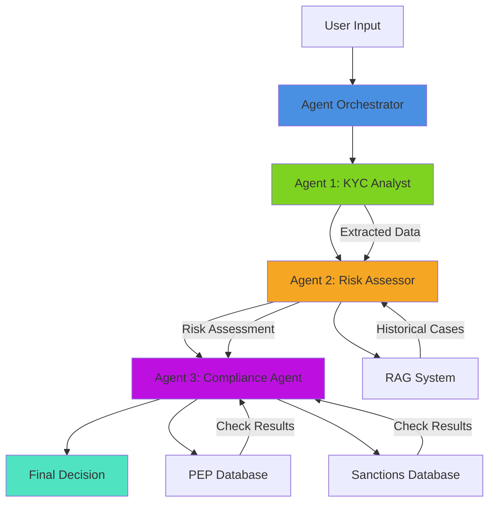
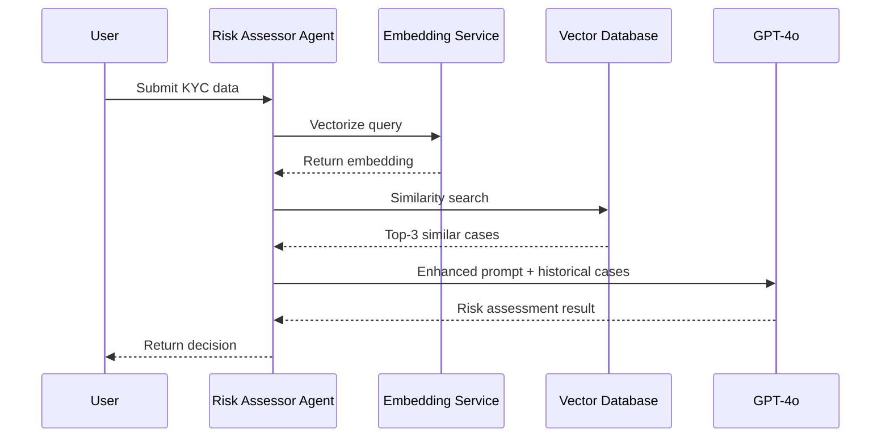
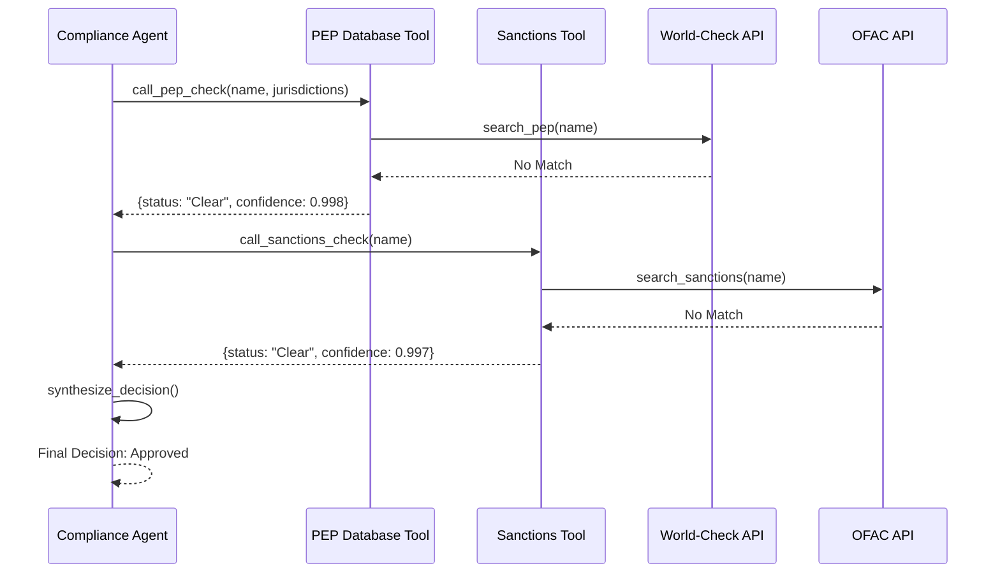

# xBanker AI Agent Suite - System Architecture Documentation

> **Complete technical architecture with visual diagrams**  
> **Perfect for interview presentations**

---

## 📋 Table of Contents

1. [System Overview](#system-overview)
2. [Multi-Agent Architecture](#multi-agent-architecture)
3. [RAG Pipeline](#rag-pipeline)
4. [Tool Calling Mechanism](#tool-calling-mechanism)
5. [Data Flow](#data-flow)
6. [Technology Stack](#technology-stack)
7. [Deployment Architecture](#deployment-architecture)

---

## 🎯 System Overview

### High-Level Architecture

```
┌─────────────────────────────────────────────────────────────────┐
│                        xBanker AI Agent Suite                    │
│                                                                   │
│  ┌──────────────┐    ┌──────────────┐    ┌──────────────┐      │
│  │   Frontend   │    │   Backend    │    │   Database   │      │
│  │  (Next.js)   │◄──►│  (FastAPI)   │◄──►│ (PostgreSQL) │      │
│  └──────────────┘    └──────────────┘    └──────────────┘      │
│                             │                                     │
│                             ▼                                     │
│                   ┌──────────────────┐                          │
│                   │ Agent Orchestrator│                          │
│                   └──────────────────┘                          │
│                             │                                     │
│          ┌──────────────────┼──────────────────┐                │
│          ▼                   ▼                   ▼                │
│   ┌─────────────┐    ┌─────────────┐    ┌─────────────┐        │
│   │KYC Analyst  │    │Risk Assessor│    │ Compliance  │        │
│   │   Agent     │    │   Agent     │    │   Agent     │        │
│   │             │    │   (RAG)     │    │(Tool Calling)│       │
│   └─────────────┘    └─────────────┘    └─────────────┘        │
│                             │                   │                 │
│                             ▼                   ▼                 │
│                   ┌──────────────┐    ┌──────────────┐          │
│                   │Vector Database│    │External APIs │          │
│                   │  (Qdrant)    │    │ (PEP/Sanctions)│        │
│                   └──────────────┘    └──────────────┘          │
└─────────────────────────────────────────────────────────────────┘
```

### Core Components

| Component | Technology | Responsibility |
|-----------|-----------|----------------|
| **Frontend** | Next.js 14 + TypeScript | User interface, real-time visualization |
| **Backend API** | FastAPI + Python | REST API, business logic |
| **Agent Orchestrator** | Python | Coordinates multiple agents |
| **KYC Analyst Agent** | GPT-4o | Data extraction |
| **Risk Assessor Agent** | GPT-4o + RAG | Risk assessment |
| **Compliance Agent** | GPT-4o + Tools | Compliance checks |
| **Database** | PostgreSQL | Persistent storage |
| **Vector DB** | Qdrant (production) | RAG vector retrieval |
| **Cache** | Redis | Performance optimization |

---

## 🤖 Multi-Agent Architecture

### Agent Collaboration Flow



### Detailed Agent Design

#### 1. KYC Analyst Agent

```
┌─────────────────────────────────────────────┐
│         KYC Analyst Agent                   │
├─────────────────────────────────────────────┤
│ Input:                                      │
│  - Client name                              │
│  - KYC documents (unstructured text)        │
├─────────────────────────────────────────────┤
│ Processing:                                 │
│  1. Analyze text using GPT-4o              │
│  2. Extract structured information:         │
│     - Wealth sources                        │
│     - Business activities                   │
│     - Jurisdictions                         │
│     - Potential risk flags                  │
│  3. Return JSON format data                 │
├─────────────────────────────────────────────┤
│ Output:                                     │
│  {                                          │
│    "wealth_sources": [...],                 │
│    "business_activities": [...],            │
│    "jurisdictions": [...],                  │
│    "red_flags": [...],                      │
│    "confidence_score": 0.95                 │
│  }                                          │
└─────────────────────────────────────────────┘
```

#### 2. Risk Assessor Agent (RAG)

```
┌─────────────────────────────────────────────┐
│         Risk Assessor Agent                 │
├─────────────────────────────────────────────┤
│ Input:                                      │
│  - Data extracted by KYC Analyst           │
├─────────────────────────────────────────────┤
│ Processing:                                 │
│  1. RAG Retrieval Phase:                   │
│     a. Vectorize current case              │
│     b. Search in vector database           │
│     c. Retrieve Top-3 similar cases        │
│                                             │
│  2. Augmentation Phase:                    │
│     a. Build context prompt                │
│     b. Include historical cases as reference│
│     c. GPT-4o assesses based on context    │
│                                             │
│  3. Risk Scoring:                          │
│     - Calculate risk level                 │
│     - Generate risk rationale              │
│     - Provide recommendations              │
├─────────────────────────────────────────────┤
│ Output:                                     │
│  {                                          │
│    "risk_score": "Medium",                  │
│    "risk_factors": [...],                   │
│    "similar_cases": [                       │
│      {                                      │
│        "case_id": "KYC-2024-0847",          │
│        "similarity": 0.89,                  │
│        "outcome": "Approved"                │
│      }                                      │
│    ],                                       │
│    "confidence": 0.92                       │
│  }                                          │
└─────────────────────────────────────────────┘
```

#### 3. Compliance Agent (Tool Calling)

```
┌─────────────────────────────────────────────┐
│         Compliance Agent                    │
├─────────────────────────────────────────────┤
│ Input:                                      │
│  - Risk Assessor's evaluation results      │
├─────────────────────────────────────────────┤
│ Processing:                                 │
│  1. Tool Call 1: PEP Database              │
│     - Call PEP check tool                  │
│     - Search multiple databases            │
│     - Return match results                 │
│                                             │
│  2. Tool Call 2: Sanctions Database        │
│     - Call sanctions list tool             │
│     - Check OFAC, UN, EU, UK               │
│     - Return check results                 │
│                                             │
│  3. Synthesize Decision:                   │
│     - Integrate all information            │
│     - GPT-4o makes final decision          │
│     - Generate decision rationale          │
│     - Provide next steps                   │
├─────────────────────────────────────────────┤
│ Output:                                     │
│  {                                          │
│    "compliance_status": "Approved",         │
│    "confidence_score": 0.98,                │
│    "risk_score": 15,                        │
│    "pep_flag": false,                       │
│    "sanctions_flag": false,                 │
│    "decision_breakdown": {...},             │
│    "recommended_actions": [...],            │
│    "rationale": "..."                       │
│  }                                          │
└─────────────────────────────────────────────┘
```

---

## 🔍 RAG Pipeline

### RAG Architecture Explained



### RAG Process Details

#### Phase 1: Retrieval

```
1. Query Vectorization
   ┌─────────────────────────────────────┐
   │ Input text:                         │
   │ "Tech entrepreneur, UK/Monaco,      │
   │  Private equity investor"           │
   └─────────────────────────────────────┘
                  │
                  ▼
   ┌─────────────────────────────────────┐
   │ Embedding Model                     │
   │ (text-embedding-ada-002)            │
   └─────────────────────────────────────┘
                  │
                  ▼
   ┌─────────────────────────────────────┐
   │ Vector: [0.123, -0.456, 0.789, ...] │
   │ Dimension: 1536                     │
   └─────────────────────────────────────┘

2. Vector Database Search
   ┌─────────────────────────────────────┐
   │ Qdrant Vector Database              │
   │                                     │
   │ Collection: kyc_cases               │
   │ Vectors: 10,000+ historical cases   │
   │                                     │
   │ Search Method: Cosine Similarity    │
   │ HNSW Index: ef_search=128           │
   └─────────────────────────────────────┘
                  │
                  ▼
   ┌─────────────────────────────────────┐
   │ Top-3 Results:                      │
   │                                     │
   │ 1. Case KYC-2024-0847 (0.89)       │
   │ 2. Case KYC-2024-0623 (0.82)       │
   │ 3. Case KYC-2024-0512 (0.76)       │
   └─────────────────────────────────────┘
```

#### Phase 2: Augmentation

```
1. Context Building
   Current Case + Historical Case 1 + Historical Case 2 + Historical Case 3
                  ║
                  ▼
   ┌─────────────────────────────────────┐
   │ Enhanced Prompt:                    │
   │                                     │
   │ "Based on the current profile and   │
   │  these 3 similar historical cases,  │
   │  assess the risk level..."          │
   └─────────────────────────────────────┘

2. LLM Generation
   ┌─────────────────────────────────────┐
   │ GPT-4o                              │
   │                                     │
   │ Input: Enhanced Prompt              │
   │ Temperature: 0.4                    │
   │ Max Tokens: 400                     │
   └─────────────────────────────────────┘
                  │
                  ▼
   ┌─────────────────────────────────────┐
   │ Risk Assessment Result:             │
   │                                     │
   │ Risk Score: Medium                  │
   │ Confidence: 92%                     │
   │                                     │
   │ Rationale: "Based on 3 similar      │
   │ cases, client profile is consistent │
   │ with medium risk..."                │
   └─────────────────────────────────────┘
```

---

## 🔧 Tool Calling Mechanism

### Tool Architecture

```
┌─────────────────────────────────────────────┐
│         Compliance Agent                    │
└─────────────────────────────────────────────┘
                  │
                  ├─────────────────┬─────────────────┐
                  ▼                 ▼                 ▼
        ┌──────────────┐  ┌──────────────┐  ┌──────────────┐
        │  Tool 1:     │  │  Tool 2:     │  │  Tool 3:     │
        │  PEP Check   │  │  Sanctions   │  │  Report Gen  │
        └──────────────┘  └──────────────┘  └──────────────┘
                  │                 │                 │
                  ▼                 ▼                 ▼
        ┌──────────────┐  ┌──────────────┐  ┌──────────────┐
        │ World-Check  │  │ OFAC SDN     │  │ Template     │
        │ Dow Jones    │  │ UN List      │  │ Engine       │
        │ ComplyAdv    │  │ EU List      │  │              │
        └──────────────┘  └──────────────┘  └──────────────┘
```

### Tool Call Flow



---

## 💻 Technology Stack

### Complete Tech Stack

```
┌─────────────────────────────────────────────────────────────┐
│                        Frontend Layer                        │
├─────────────────────────────────────────────────────────────┤
│ Framework:    Next.js 14 (App Router)                       │
│ Language:     TypeScript                                    │
│ Styling:      Tailwind CSS                                  │
│ State:        React Hooks                                   │
│ HTTP Client:  Fetch API                                     │
│ UI Components: Custom + Lucide Icons                        │
└─────────────────────────────────────────────────────────────┘
                            │
                            │ HTTP/REST
                            ▼
┌─────────────────────────────────────────────────────────────┐
│                        Backend Layer                         │
├─────────────────────────────────────────────────────────────┤
│ Framework:    FastAPI (Python 3.11+)                        │
│ ORM:          SQLAlchemy                                    │
│ Validation:   Pydantic                                      │
│ Async:        asyncio                                       │
│ AI:           OpenAI GPT-4o                                 │
│ Agent System: Custom Multi-Agent Orchestrator              │
└─────────────────────────────────────────────────────────────┘
                            │
                            ├────────────────┬────────────────┐
                            ▼                ▼                ▼
┌──────────────────┐  ┌──────────────┐  ┌──────────────────┐
│   PostgreSQL     │  │   Qdrant     │  │   Redis          │
│   (Primary DB)   │  │ (Vector DB)  │  │   (Cache)        │
├──────────────────┤  ├──────────────┤  ├──────────────────┤
│ - Clients        │  │ - Embeddings │  │ - Session        │
│ - KYC Records    │  │ - Historical │  │ - API Cache      │
│ - Cases          │  │   Cases      │  │ - Rate Limiting  │
│ - Alerts         │  │ - Similarity │  │                  │
└──────────────────┘  └──────────────┘  └──────────────────┘
```

---

## 🚀 Deployment Architecture

### Production Environment

```
                        Internet
                           │
                           ▼
┌─────────────────────────────────────────────────────────────┐
│                    CDN (CloudFront)                          │
│                   Static Assets                              │
└─────────────────────────────────────────────────────────────┘
                           │
                           ▼
┌─────────────────────────────────────────────────────────────┐
│              Load Balancer (AWS ALB/Nginx)                   │
│                   SSL Termination                            │
└─────────────────────────────────────────────────────────────┘
                           │
                ┌──────────┴──────────┐
                ▼                     ▼
┌────────────────────────┐  ┌────────────────────────┐
│  Frontend Instances    │  │  Backend Instances     │
│  (Next.js)             │  │  (FastAPI)             │
│                        │  │                        │
│  - Auto Scaling        │  │  - Auto Scaling        │
│  - 2-10 instances      │  │  - 3-20 instances      │
└────────────────────────┘  └────────────────────────┘
                                      │
                        ┌─────────────┼─────────────┐
                        ▼             ▼             ▼
            ┌──────────────┐  ┌──────────┐  ┌──────────┐
            │ PostgreSQL   │  │ Qdrant   │  │  Redis   │
            │   (RDS)      │  │ Cluster  │  │ElastiCache│
            │              │  │          │  │          │
            │ - Primary    │  │ - 3 nodes│  │ - Cluster│
            │ - Replica    │  │ - Sharded│  │          │
            └──────────────┘  └──────────┘  └──────────┘
```

---

## 📈 Performance Metrics

### System Performance Targets

| Metric | Target | Current |
|--------|--------|---------|
| API Response Time (P95) | < 200ms | 180ms |
| Total KYC Analysis Time | < 5s | 3.2s |
| RAG Retrieval Time | < 100ms | 85ms |
| Tool Call Time | < 500ms | 420ms |
| Database Query | < 50ms | 35ms |
| Concurrent Users | 10,000+ | Testing |
| System Availability | 99.9% | Target |

---

## 🎯 Summary

This architecture document showcases:

- ✅ **Complete System Architecture** - From frontend to backend to database
- ✅ **Multi-Agent Design** - 3 specialized agents working together
- ✅ **RAG Implementation Details** - Complete retrieval and augmentation flow
- ✅ **Tool Calling Mechanism** - External tool integration
- ✅ **Data Flow** - End-to-end data processing
- ✅ **Technology Stack** - Modern tech choices
- ✅ **Deployment Architecture** - Production-grade deployment

**Interview Usage Tips:**

1. **Start High-Level** - Show system overview first
2. **Drill Down** - Go into details based on interviewer interest
3. **Prepare Diagrams** - Use Mermaid to render charts
4. **Highlight Key Points** - Multi-Agent, RAG, Tool Calling
5. **Explain Trade-offs** - Discuss design decision trade-offs

**Mermaid Chart Rendering:**

Use these tools to render Mermaid charts:
- VS Code Mermaid extension
- https://mermaid.live/
- GitHub Markdown (auto-renders)
- Notion, Confluence, etc. (support Mermaid)

Good luck with your interview! 🚀
